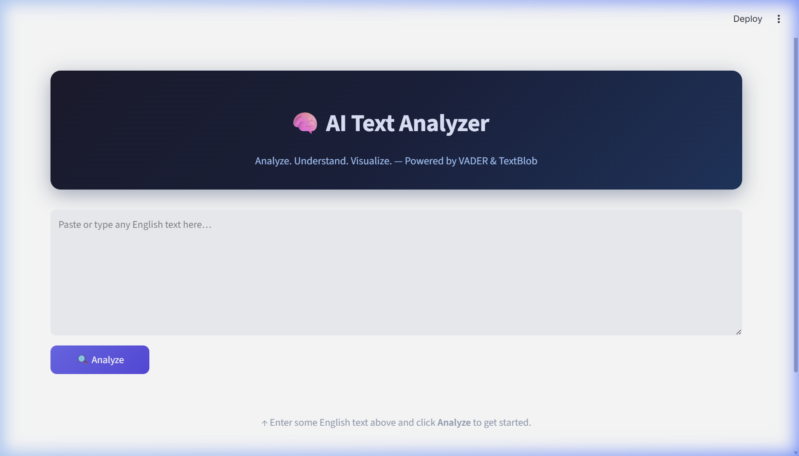
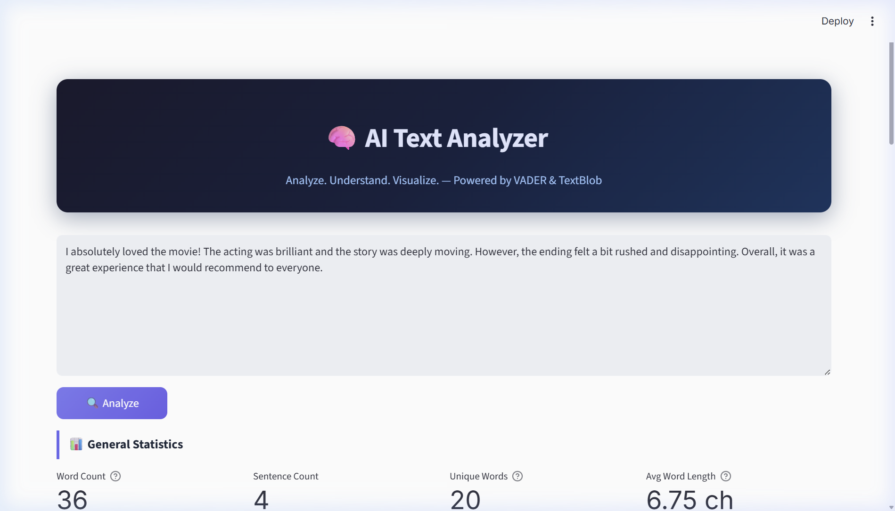
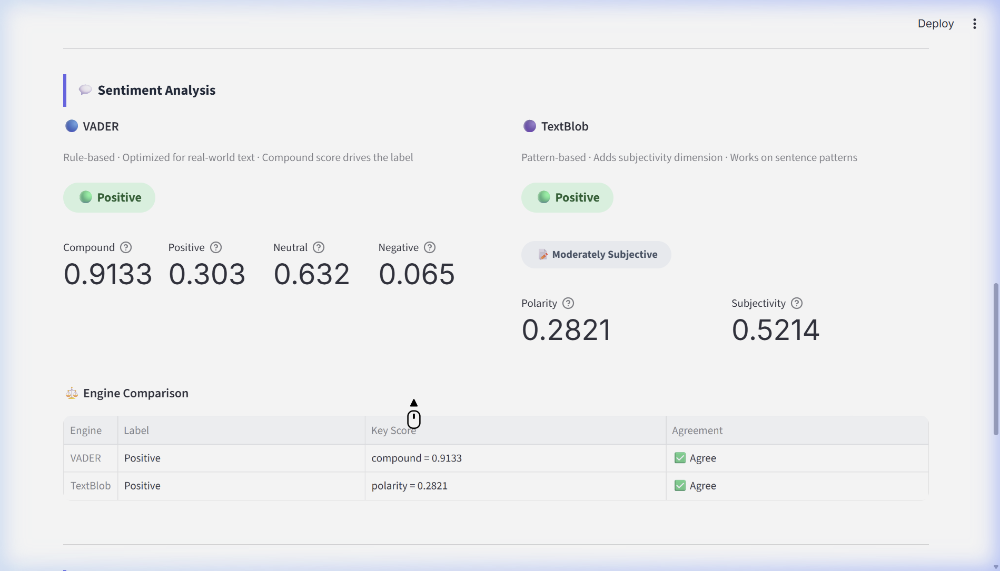
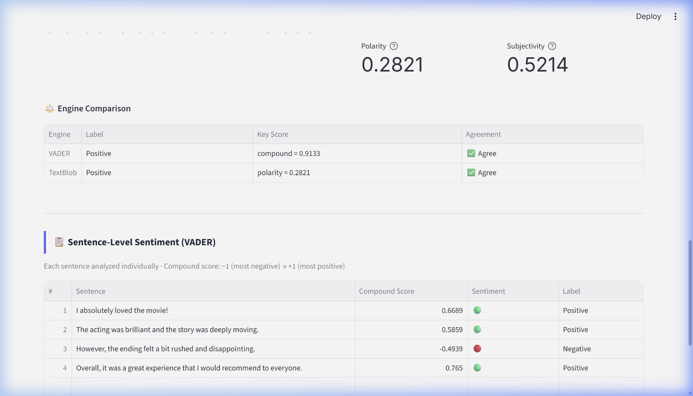

# 🧠 AI Text Analyzer

> **Analyze. Understand. Visualize.** — Powered by VADER & TextBlob

🌐 **Live Demo:** [ai-text-analyzergit-elifkanik.streamlit.app](https://ai-text-analyzergit-elifkanik.streamlit.app/)

A Python-based web application that analyzes English text using two independent NLP sentiment engines — VADER and TextBlob — alongside a full text statistics pipeline. Built with Streamlit for an interactive, metrics-driven interface.

---

## 📸 Screenshots

### Home Screen


### Analysis Results — General Statistics & Word Frequency


### Dual-Engine Sentiment Analysis & Engine Comparison


### Sentence-Level Sentiment Breakdown


---

## ✨ Features

- **NLP Preprocessing Pipeline** — tokenization → stop word removal → lemmatization (NLTK)
- **Word Frequency Analysis** — top-15 content words ranked by frequency with percentage breakdown
- **Dual-Engine Sentiment Analysis**
  - **VADER** (`vaderSentiment`) — rule-based lexicon analyzer; returns `compound`, `pos`, `neu`, `neg` scores
  - **TextBlob** — pattern-based analyzer; returns `polarity` and `subjectivity` scores
- **Engine Comparison Table** — side-by-side label and score comparison with agreement indicator
- **Sentence-Level Sentiment** — per-sentence VADER scores with emoji visual indicators
- **General Text Statistics** — word count, sentence count, unique words, average word length

---

## 🔬 How It Works

```
Raw Text
   │
   ▼
NLTK word_tokenize
   │
   ▼
Lowercase + Remove punctuation + Remove stop words
   │
   ▼
WordNetLemmatizer  →  Frequency Counter
   │
   ├──▶ VADER SentimentIntensityAnalyzer  →  compound / pos / neu / neg
   │
   └──▶ TextBlob  →  polarity / subjectivity
```

Each sentence is also independently analyzed by VADER to reveal intra-text sentiment shifts.

---

## 🛠 Tech Stack

| Layer | Library | Purpose |
|-------|---------|---------|
| Web UI | `streamlit` | Interactive web interface |
| NLP Preprocessing | `nltk` | Tokenization, stop words, lemmatization |
| Sentiment (rule-based) | `vaderSentiment` | Lexicon + heuristic sentiment scoring |
| Sentiment (pattern-based) | `textblob` | Polarity & subjectivity scoring |
| Data manipulation | `pandas` | Tabular data handling |

---

## 📦 Installation & Usage

**Prerequisites:** Python 3.9+

```bash
# 1. Clone the repository
git clone https://github.com/yourusername/ai-text-analyzer.git
cd ai-text-analyzer

# 2. Install dependencies
pip install -r requirements.txt

# 3. Run the app
streamlit run app.py
```

The app will open at **http://localhost:8501**

---

## 📁 Project Structure

```
ai-text-analyzer/
├── app.py                    # Streamlit entry point & UI
├── analyzer/
│   ├── __init__.py
│   ├── word_frequency.py     # Tokenization, lemmatization, frequency counting
│   ├── sentiment.py          # VADER + TextBlob engines, sentence-level analysis
│   └── formatter.py          # Metric helpers and DataFrame formatting
├── docs/
│   └── *.png                 # Screenshots
├── requirements.txt
└── README.md
```

---

## 📊 Output Explained

| Section | Description |
|---------|-------------|
| **General Statistics** | Total word count, sentence count, unique lemmatized words, average word length |
| **Word Frequency** | Top-15 content words (stop words removed, lemmatized) with frequency and percentage |
| **VADER Sentiment** | `compound` (−1 → +1 overall score), `pos`/`neu`/`neg` proportions |
| **TextBlob Sentiment** | `polarity` (−1 → +1), `subjectivity` (0 = objective, 1 = subjective) |
| **Engine Comparison** | Side-by-side labels and key scores; highlights if engines agree or disagree |
| **Sentence-Level** | Per-sentence VADER compound scores with Positive / Negative / Neutral labels |

---

<br>

---

# 🇹🇷 Türkçe

> **Analiz Et. Anla. Görselleştir.** — VADER ve TextBlob ile çalışır

🌐 **Canlı Demo:** [ai-text-analyzergit-elifkanik.streamlit.app](https://ai-text-analyzergit-elifkanik.streamlit.app/)

İngilizce metinleri iki bağımsız NLP duygu analizi motoru — VADER ve TextBlob — kullanarak analiz eden, Streamlit tabanlı Python web uygulaması. Arayüz tamamen tablo ve metrik kartı odaklı olup herhangi bir grafiğe ihtiyaç duymaz.

---

## 📸 Ekran Görüntüleri

### Ana Ekran


### Analiz Sonuçları — Genel İstatistikler & Kelime Frekansı


### Çift Motorlu Duygu Analizi & Motor Karşılaştırması


### Cümle Bazlı Duygu Analizi


---

## ✨ Özellikler

- **NLP Ön İşleme Pipeline'ı** — tokenizasyon → stop word temizleme → lemmatizasyon (NLTK)
- **Kelime Frekansı Analizi** — en sık kullanılan 15 içerik kelimesi, frekans ve yüzde ile
- **Çift Motorlu Duygu Analizi**
  - **VADER** — kural tabanlı sözlük analizi; `compound`, `pos`, `neu`, `neg` skorları
  - **TextBlob** — örüntü tabanlı analiz; `polarity` (duygu) ve `subjectivity` (öznellik)
- **Motor Karşılaştırma Tablosu** — iki motorun etiket ve skorlarını yan yana gösterir, anlaşıp anlaşmadıklarını işaretler
- **Cümle Bazlı Analiz** — her cümle ayrı ayrı VADER ile analiz edilir
- **Genel Metin İstatistikleri** — kelime sayısı, cümle sayısı, unique kelime sayısı, ortalama kelime uzunluğu

---

## 🔬 Nasıl Çalışır?

```
Ham Metin
   │
   ▼
NLTK word_tokenize ile tokenizasyon
   │
   ▼
Küçük harfe çevirme + Noktalama temizleme + Stop word kaldırma
   │
   ▼
WordNetLemmatizer  →  Frekans Sayımı
   │
   ├──▶ VADER SentimentIntensityAnalyzer  →  compound / pos / neu / neg
   │
   └──▶ TextBlob  →  polarity / subjectivity
```

Her cümle ayrıca VADER ile bağımsız olarak analiz edilir; böylece metin içindeki duygu dalgalanmaları gözlemlenebilir.

---

## 🛠 Teknoloji Yığını

| Katman | Kütüphane | Amaç |
|--------|-----------|-------|
| Web Arayüzü | `streamlit` | İnteraktif web uygulaması |
| NLP Ön İşleme | `nltk` | Tokenizasyon, stop word, lemmatizasyon |
| Duygu Analizi (kural tabanlı) | `vaderSentiment` | Sözlük + sezgisel skor hesaplama |
| Duygu Analizi (örüntü tabanlı) | `textblob` | Polarite ve öznellik skoru |
| Veri işleme | `pandas` | Tablo yönetimi |

---

## 📦 Kurulum & Kullanım

**Gereksinim:** Python 3.9+

```bash
# 1. Repository'yi klonla
git clone https://github.com/yourusername/ai-text-analyzer.git
cd ai-text-analyzer

# 2. Bağımlılıkları yükle
pip install -r requirements.txt

# 3. Uygulamayı çalıştır
streamlit run app.py
```

Uygulama **http://localhost:8501** adresinde açılır.

---

## 📁 Proje Yapısı

```
ai-text-analyzer/
├── app.py                    # Streamlit giriş noktası & arayüz
├── analyzer/
│   ├── __init__.py
│   ├── word_frequency.py     # Tokenizasyon, lemmatizasyon, frekans sayımı
│   ├── sentiment.py          # VADER + TextBlob motorları, cümle analizi
│   └── formatter.py          # Metrik ve tablo formatlama yardımcıları
├── docs/
│   └── *.png                 # Ekran görüntüleri
├── requirements.txt
└── README.md
```

---

## 📊 Çıktı Açıklamaları

| Bölüm | Açıklama |
|-------|----------|
| **Genel İstatistikler** | Toplam kelime sayısı, cümle sayısı, unique kelimeler, ortalama kelime uzunluğu |
| **Kelime Frekansı** | Stop word'ler temizlenmiş, lemmatize edilmiş en sık 15 kelime |
| **VADER Duygu Analizi** | `compound` (−1 → +1 genel skor), `pos`/`neu`/`neg` oranları |
| **TextBlob Duygu Analizi** | `polarity` (−1 → +1), `subjectivity` (0 = nesnel, 1 = öznel) |
| **Motor Karşılaştırması** | İki motorun etiket ve skor karşılaştırması; anlaşma göstergesi |
| **Cümle Bazlı Analiz** | Cümle başına VADER compound skoru, Positive / Negative / Neutral etiketleri |
